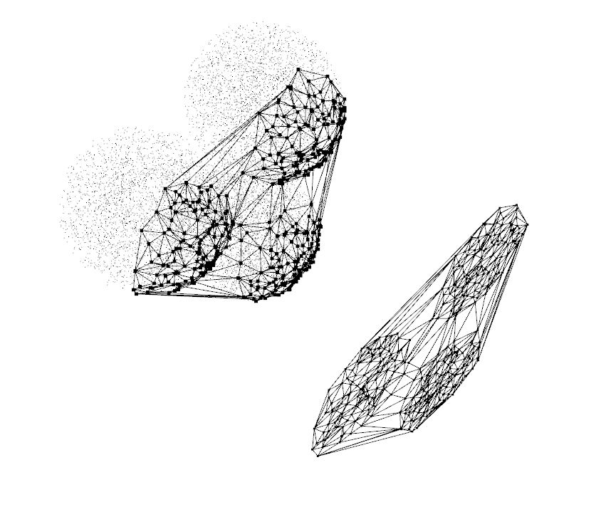
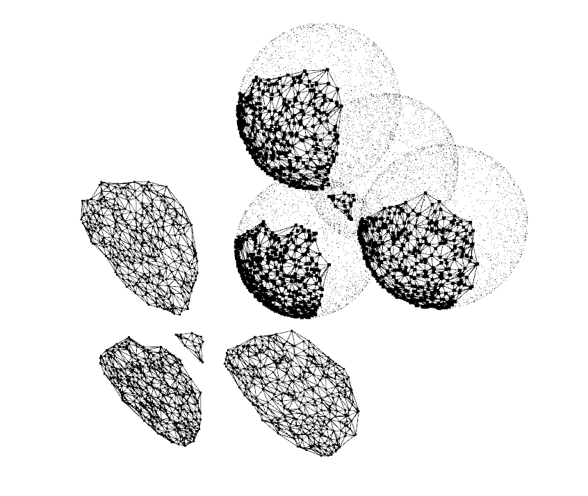
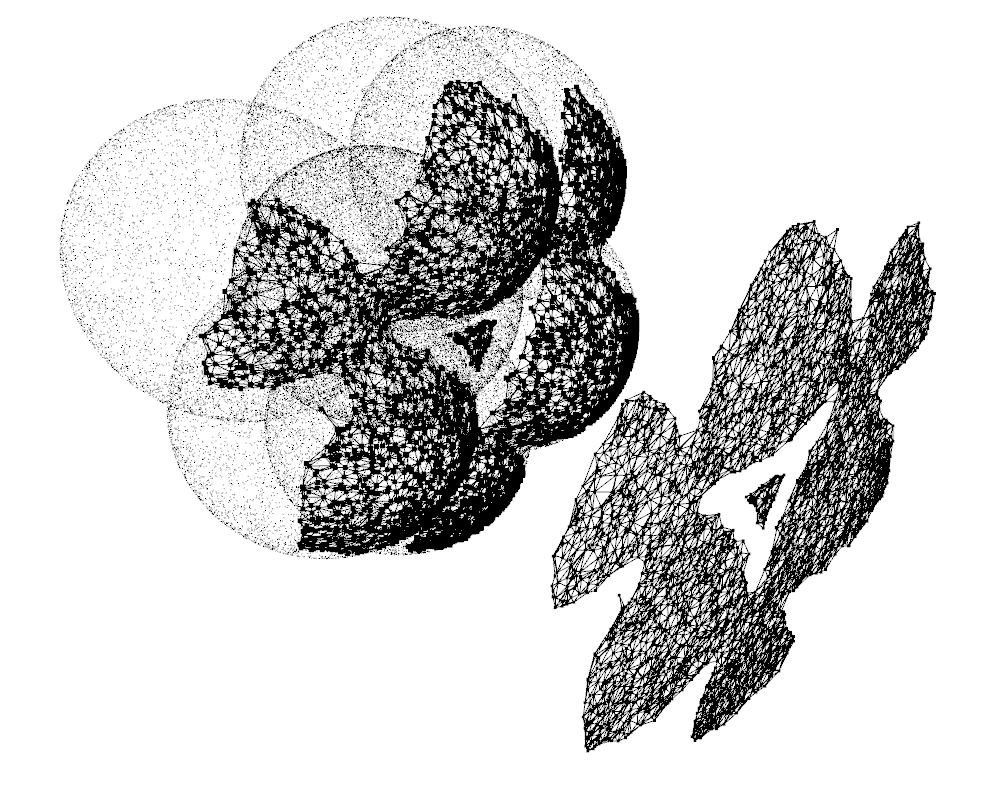
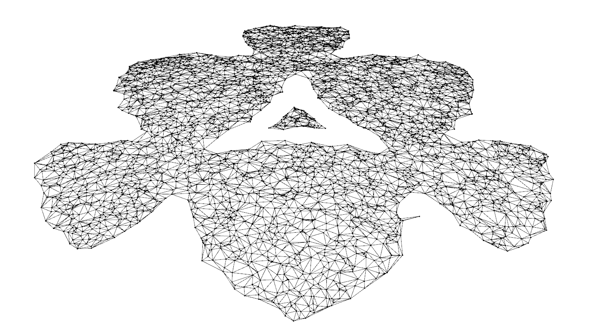

# Generating Tessellations of N-dimensional Pareto Frontiers for Visualization and Configuration

[Read the report.](docs/report/main.pdf)

## Author
- Markus Pawellek (lyrahgames@mailbox.org)

## Examples

